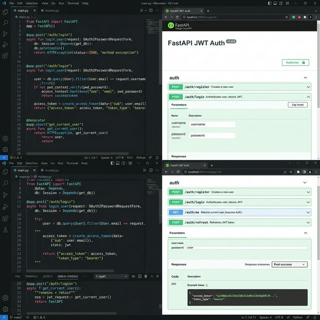

# Secure API Auth Boilerplate (FastAPI)

A production-ready authentication backend that provides secure user registration, login, and role-based access control out of the box.

✔ Saves weeks of backend development time for new SaaS products
✔ Follows strict security best practices with hashed passwords and token rotation
✔ Highly scalable architecture built on asynchronous Python and PostgreSQL

## Use Cases
- **SaaS Backends:** Instantly bootstrap a secure user management system for a new pre-MVP application.
- **Mobile App APIs:** Provide a robust, documented REST API for mobile app logins.
- **Internal Enterprise Tools:** Secure internal dashboards with strict `admin` and `user` role privileges.

## Project Structure

```
fastapi-jwt-auth/
├── main.py
├── app/
│   ├── config.py        # Settings from .env
│   ├── database.py      # Async engine + session
│   ├── models.py        # SQLAlchemy User model
│   ├── schemas.py       # Pydantic request/response schemas
│   ├── security.py      # Password hashing + JWT utils
│   ├── dependencies.py  # get_current_user, require_role
│   └── routers/
│       ├── auth.py      # /auth/register, /auth/login, /auth/refresh
│       └── users.py     # /users/me, /users/ (admin)
├── requirements.txt
└── .env.example
```

## Setup

```bash
# 1. Install dependencies
pip install -r requirements.txt

# 2. Configure environment
cp .env.example .env
# Edit DATABASE_URL and SECRET_KEY

# 3. Run (auto-creates tables on startup)
uvicorn main:app --reload
```

Interactive docs: http://localhost:8000/docs

## API Reference

### Auth

| Method | Endpoint | Description |
|---|---|---|
| `POST` | `/auth/register` | Create new account |
| `POST` | `/auth/login` | Get access + refresh tokens |
| `POST` | `/auth/refresh` | Exchange refresh token for new access token |

### Users

| Method | Endpoint | Auth | Description |
|---|---|---|---|
| `GET` | `/users/me` | User | Get own profile |
| `PATCH` | `/users/me` | User | Update username |
| `POST` | `/users/me/change-password` | User | Change password |
| `GET` | `/users/` | Admin | List all users |
| `PATCH` | `/users/{id}/deactivate` | Admin | Deactivate a user |

## Example Requests

**Register:**
```bash
curl -X POST http://localhost:8000/auth/register \
  -H "Content-Type: application/json" \
  -d '{"email": "user@example.com", "username": "johndoe", "password": "Secret123"}'
```

**Login:**
```bash
curl -X POST http://localhost:8000/auth/login \
  -H "Content-Type: application/json" \
  -d '{"email": "user@example.com", "password": "Secret123"}'
# Returns: { "access_token": "...", "refresh_token": "...", "token_type": "bearer" }
```

**Authenticated request:**
```bash
curl http://localhost:8000/users/me \
  -H "Authorization: Bearer <access_token>"
```

## Tech Stack

`fastapi` · `sqlalchemy[asyncio]` · `asyncpg` · `passlib[bcrypt]` · `python-jose` · `pydantic` · `alembic`

## Screenshot



